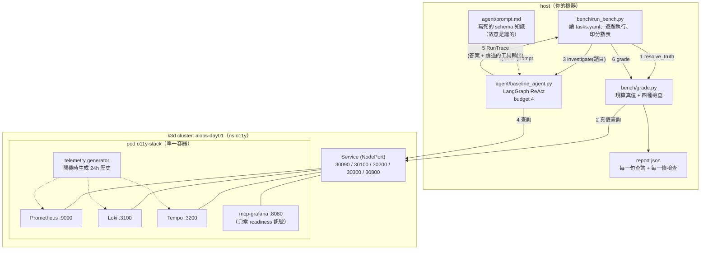
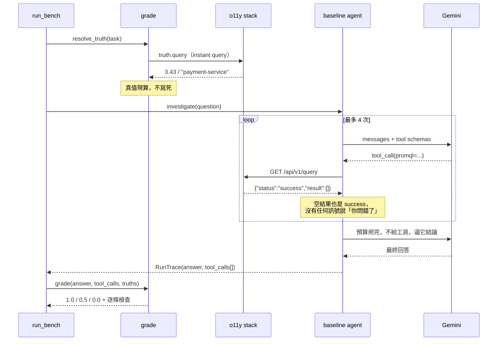

# Day1 — 失敗現場：一個查得動 Prometheus 的 agent，為什麼只拿 4.5/9 分

對應文章：**Day1**（《AIOps with OpenTelemetry》第一天）。

這個資料夾裡有三個東西，合起來就是那張分數表的產生方式：

| 路徑 | 是什麼 |
|---|---|
| `k8s/` | k3d cluster 設定與 o11y stack 的 manifest——被調查的那套系統 |
| `agent/` | 被測的 agent 本身：三個查詢工具、寫死的 schema 知識、4 次 tool call 預算 |
| `bench/` | 九題 RCA 與**不接 LLM** 的評分器，輸出 `report.json` |

**這一天不修任何東西。** agent 的每一個缺陷都是刻意保留的，後面 29 天會一項一項回來拆。

---

## 系統組成

四個角色，兩邊：**被調查的系統**跑在 cluster 裡，**調查的人跟打分的人**跑在 host 上。這條分界線是刻意的——agent 用的是任何人從外面都連得到的原生 HTTP API，它完全不知道自己在跟 Kubernetes 講話，所以今天量到的東西不會被「我幫 agent 開了後門」污染。



**agent 跟評分器打的是同一組端點**，這點很重要：真值不是另一套資料算出來的，是評分當下拿一句正規查詢去問同一個 Prometheus/Loki/Tempo。agent 沒有藉口說它看到的是別的世界。

### 一題的生命週期



`RunTrace` 同時帶著**回答**跟**它讀過的每一份工具輸出**，這是 `grounded` 檢查能成立的原因：要判斷一個 trace id 是不是編的，你必須手上同時有「它說了什麼」跟「它看過什麼」。

### 為什麼 stack 是一個 pod 而不是四個

這套 stack 是**被觀察的對象**，不是這系列要教的東西。拆成四個 Deployment 只會讓 README 多四份設定，而 agent 下的每一句查詢一個字都不會變。Collector 的部署形態怎麼影響資料完整性，是 Day10 的題目，那天才值得拆開。

| host port | 對到 | 誰在用 |
|---|---|---|
| 9090 | Prometheus | agent 的 `prometheus_query`、評分器的真值查詢 |
| 3100 | Loki | agent 的 `loki_query`、評分器的真值查詢 |
| 3200 | Tempo | agent 的 `tempo_search`、評分器確認查詢有結果 |
| 3000 | Grafana | 人工翻資料用，bench 不碰 |
| 8080 | mcp-grafana | 只當 readiness 訊號（見下面第二個坑） |

---

## 需要什麼

- `docker`、`k3d`、`kubectl`
- Python 3.11+ 與 [`uv`](https://docs.astral.sh/uv/)
- 一組 `GOOGLE_API_KEY`（預設模型 `gemini-3.1-flash-lite`，用 `BASELINE_MODEL` 換）
- o11y stack image。它建在母 repo：

  ```bash
  git clone https://github.com/tedmax100/o11y-bench
  cd o11y-bench
  docker build -t o11y-bench-o11y-stack:latest -f docker/Dockerfile docker
  ```

## 跑一次

指令都從這個 repo 的根目錄下跑。

```bash
# 1. 起 cluster（第一次要 import 1.5GB 的 image，加上生成遙測，約 5-8 分鐘）
./ironman-2026/day01/scripts/up.sh

# 2. 裝相依
uv venv --project ironman-2026/day01
uv pip install --project ironman-2026/day01 -r <(echo "httpx
langchain-core>=0.3
langchain-google-genai>=2.0
langgraph>=0.2
pyyaml")

# 3. 跑九題
export GOOGLE_API_KEY=...
cd ironman-2026/day01 && .venv/bin/python -m bench.run_bench
```

實跑輸出（`--seeds 3`，2026-08-01）：

```
Day1 baseline — model gemini-3.1-flash-lite, tool budget 4, 3 seed(s)

  task                                 signal    score  first failing check
  ----------------------------------------------------------------------------------------
  promql-error-rate                    metrics  PARTIAL  number: main: closest stated 6 vs truth 2.978
  promql-highest-backend-error-ratio   metrics    FAIL  contains: none of ['payment-service'] in the answer
  promql-discover-http-metric          metrics    FAIL  contains: none of ['job'] in the answer
  logql-payment-warning-volume         logs     PARTIAL  number: main: closest stated 0 vs truth 60
  logql-retry-vs-real-errors           logs     PARTIAL  number: retries: closest stated 68 vs truth 103
  logql-top-5xx-endpoint               logs       FAIL  contains: none of ['/api/payments'] in the answer
  traceql-find-service-traces          traces     PASS
  traceql-error-chain-orders           traces     PASS
  traceql-error-span-analysis          traces     PASS
  ----------------------------------------------------------------------------------------
  TOTAL                                          4.5/9

  metrics  0.5/3
  logs     1.0/3
  traces   3.0/3
```

三個 seed 的逐題分數完全一致——這隻 agent 錯得很穩定，不是偶爾失手。

完整逐題紀錄（每一個下過的查詢、每一條檢查）在 `report.json`。

收工：

```bash
./ironman-2026/day01/scripts/down.sh
```

---

## 九題是什麼

三種訊號各三題，全部是「回答一個要先查資料才知道的問題」：

| 訊號 | 題目 | 考什麼 |
|---|---|---|
| metrics | `promql-error-rate` | 跨三個服務的 5xx 佔比，要涵蓋完整 6 小時窗 |
| metrics | `promql-highest-backend-error-ratio` | 排名 + 數字，兩者都要對 |
| metrics | `promql-discover-http-metric` | 得先發現這個環境用哪個 metric／label |
| logs | `logql-payment-warning-volume` | 單一服務的 warning 量 |
| logs | `logql-retry-vs-real-errors` | 兩個數字的對比，一次查不完 |
| logs | `logql-top-5xx-endpoint` | JSON 解析 + 分組取 top1 |
| traces | `traceql-find-service-traces` | 找得到 trace 並引用 trace id |
| traces | `traceql-error-chain-orders` | 特定 route 的失敗鏈 |
| traces | `traceql-error-span-analysis` | span 層級的證據 |

## 評分為什麼不接 LLM

Day1 的產出是一個「後面 29 天都會回頭對照」的數字。**一個會因為判官模型換版而浮動的數字沒有用**，所以 `bench/grade.py` 是純 Python：

- `number`——答案裡的數字要落在真值的相對容差內
- `contains`——要講到該講的服務／路徑／metric 名
- `queried`——真的下過查詢（抓「一個字都沒查就講得頭頭是道」）
- `grounded`——**答案裡出現的每一個 trace id，都必須在某次工具輸出裡出現過**

真值不是寫死的，是評分當下拿 `truth.query` 去打同一套 stack 算出來的——遙測每次開 cluster 都重新生成，寫死的期望值幾分鐘後就是錯的，而**一個會給錯答案的評分器比沒有評分器更糟**。

判分只有三檔：全部通過 = 1.0，只有「形狀對」的檢查通過（有查、有講對服務，但數字或 grounding 錯）= 0.5，其餘 = 0。那個 0.5 的檔位就是這一天最想給讀者看的東西：**一份讀起來很專業、但數字是錯的報告。**

## 分數會不會浮動

實測下來比預期穩：三個 seed 的逐題分數一模一樣，只有 `traceql-error-chain-orders` 在更早的單次執行裡掉過一次（總分 3.5 vs 4.5）。但有三個浮動來源還是要知道：

1. **遙測是每次開 cluster 重新生成的**，真值會變（所以評分當下才現算），題目難度也會略有起伏。
2. **模型有隨機性**，即使 `temperature=0`。`--seeds 3` 取平均會穩一些，代價是三倍的 API 花費。
3. **評分器對「答案裡的數字」取最接近真值的那一個**。這對 agent 是寬容的——它列了三個數字而其中一個剛好對，也算過。這個寬容是故意的：Day1 要證明的是它連這樣都過不了。

## 評分器自己的三個 bug（都修好了，但值得留著看）

第一版評分器給出 6.0/9，其中 `promql-error-rate` 判 PASS——而那題的回答第一句話是 "I am unable to calculate"。

1. **Gemini 的 content 是 block 陣列，不是字串。** 其中一塊是 thought signature（一長串 base64）。`str(content)` 看起來像答案，實際上夾帶幾百個數字，評分器從裡面撈到一個剛好落在容差內的值。修法是 `_flatten_content()` 只取 text block。
2. **`5xx` 裡的 `5` 被當成一個數字。** 而九題裡每一題都有 `5xx`。修法是數字的正規表示式加上 lookaround，排除跟字母黏在一起的數字（也順便排掉 `p99`、`v2.5.0`）。
3. **Loki 的 `count_over_time(...[6h])` 不能用 range query 跑。** 60 秒 step 會讓 Loki 每 60 秒各算一次「過去六小時」，回 360 個高度重疊的窗；把它們加總，真值膨脹約 160 倍（60 → 9817）。修法是改用 instant query 一次求值。

前兩個 bug 是**放水**，第三個是**冤枉**——它會把任何一個真的答對的 agent 判成錯得離譜。三個共同點是：**都不會產生任何錯誤訊息，你只會看到一個數字。**

Day20 會把這裡的每一種失敗寫成回歸 fixture，並且把每次 eval run 綁定當下的 prompt hash 與模型 ID——**分數變好到底是改對了邏輯，還是有人順手動了 prompt**，沒有這兩個欄位是分不出來的。

---

## 踩到的坑：節點起不來，但 k3d 說成功

第一次建 cluster 時很可能撞到這個。`k3d cluster create` 印出 `Cluster created successfully`，`kubectl get pods` 也答得出來（Pending），但：

```console
$ kubectl get nodes
No resources found
```

節點根本沒註冊。`docker logs k3d-aiops-day01-server-0` 只會無限重複一行 `Waiting for containerd startup: rpc error: code = Unimplemented`，**它沒有告訴你為什麼**。真正的原因要進到節點容器裡面才看得到：

```console
$ docker exec k3d-aiops-day01-server-0 \
    grep -i "failed to load plugin" /var/lib/rancher/k3s/agent/containerd/containerd.log
level=warning msg="failed to load plugin io.containerd.grpc.v1.cri"
  error="failed to create cni conf monitor for default: failed to create fsnotify watcher: too many open files"
```

`too many open files` 指的不是 file descriptor，是 **inotify instance**。Linux 預設 `fs.inotify.max_user_instances=128`，每一座 k3d cluster 都吃掉一批，多開幾座就見底：

```bash
sysctl fs.inotify.max_user_instances          # 128
sudo sysctl -w fs.inotify.max_user_instances=512
# 永久生效
echo 'fs.inotify.max_user_instances=512' | sudo tee /etc/sysctl.d/99-inotify.conf
```

改完刪掉 cluster 重建即可。

## 第二個坑：同一個 404，compose 說健康，k8s 說沒好

把這套 stack 從 docker-compose 搬到 k3d 的時候撞到的。上游 compose 的 healthcheck 是：

```yaml
test: ["CMD", "curl", "-sS", "-o", "/dev/null", "http://localhost:8080/"]
```

`:8080` 是 mcp-grafana，它服務在 `/mcp`，對 `/` 回 **404**。而 `curl -sS -o /dev/null` 不加 `-f`，404 對它來說是「連上了」，所以 compose 一路綠燈。

同一個容器、同一個 port，換成 Kubernetes 的 `httpGet` probe 就永遠不會 Ready——**httpGet 只接受 2xx/3xx，404 一律算失敗**，而 pod NotReady 代表 Service 不會把 endpoint 掛上去，於是 `localhost:9090` 從外面也連不到。症狀是「pod Running、log 印著 Environment Ready、但什麼都連不上」。

這裡改用 `tcpSocket`：真正要確認的是「entrypoint 跑到最後一步了」，而 mcp-grafana 是最後才起來的那個，port 開了就代表前面的 Prometheus/Loki/Tempo 跟資料生成都完成了。

兩個坑加起來就是這一天的伏筆：**健康檢查是一種契約，而換一個執行環境，同一句話的意思就變了。**

前一個坑在 Day1 出現得剛剛好：**三層工具各自都「沒有錯」，但沒有任何一層把真正的原因往上傳。** k3d 說建好了，k3s 說在等 containerd，containerd 才說 inotify 不夠——而只有最底下那句話能讓你自己修好。這正是後面每一天在治理層要處理的同一件事，只是換了場景：一個 gate 擋下來之後，錯誤訊息夠不夠讓對方自己修好。
